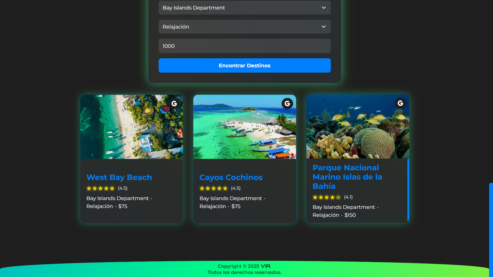

# VIA (Viaje con Inteligencia Artificial)

<div align="center">
  

  <p>
    <strong>Plataforma de recomendación de destinos turísticos con algoritmos de IA</strong>
  </p>
  
  <p>
    <a href="https://eliasjlemus.github.io/VIA/">Ver Demo</a>
  </p>
</div>

## Descripción del Proyecto

<div align="center">
  
</div>

VIA (Viaje con Inteligencia Artificial) es una plataforma web que ofrece recomendaciones personalizadas de destinos turísticos. Utilizando técnicas de inteligencia artificial, analiza las preferencias del usuario y sugiere destinos que se ajustan a sus criterios de región, país, ciudad, tipo de turismo y presupuesto.

## Características Principales

- **Navegación geográfica jerarquizada**: Selección por región → país → ciudad
- **Filtrado por intereses turísticos**: Opciones como cultural, aventura, relajación, entre otros
- **Recomendaciones basadas en presupuesto**: Control de gastos según tus posibilidades
- **Visualización atractiva de resultados**: Tarjetas con información esencial y calificaciones
- **Interfaz responsiva**: Diseño adaptable a cualquier dispositivo
- **Búsqueda directa**: Integración con Google para ampliar información sobre los destinos

## Tecnologías Utilizadas

<div align="center">
  <p>
    
    
    
    
    
    
    
    
  </p>
</div>

- **Frontend**: HTML5, CSS3, JavaScript (ES6+)
- **Análisis de Datos**: Python, Pandas, NumPy, Scikit-learn
- **Algoritmos**: Sistema de clustering K-means para la categorización de destinos
- **Integración**: API de Unsplash para imágenes dinámicas
- **Visualización**: Diseño responsivo con media queries

## Funcionamiento

1. **Selecciona una región** en el primer menú desplegable
2. **Elige un país** de la región seleccionada
3. **Selecciona una ciudad** del país elegido
4. **Indica tu tipo de turismo preferido** (Relajación, Aventura, Cultural, etc.)
5. **Define tu presupuesto individual** en dólares
6. **Haz clic en "Encontrar Destinos"** para obtener recomendaciones personalizadas
7. **Explora las opciones** presentadas según tus criterios

## Implementación Técnica

### Preprocesamiento de Datos

El sistema utiliza un dataset extenso de destinos turísticos con características como:

- Nombre del lugar
- Calificación (rating)
- Precio
- Coordenadas geográficas (lat/lng)
- Categorías de turismo (Relajación, Aventura, Cultural, Histórico, Espiritual)
- Codificación one-hot de regiones, países y ciudades

### Algoritmo de Recomendación

El núcleo de VIA es un sistema de recomendación basado en clustering que:

**Normalización de datos**: Utilizamos StandardScaler para normalizar las características numéricas, lo que garantiza que todas las variables tengan el mismo peso en el algoritmo.

```python
scaler = StandardScaler()
data_scaled = scaler.fit_transform(data_cleaned)
```

**Clustering con K-means**: Empleamos el algoritmo K-means con 8 clusters para categorizar los destinos turísticos basados en sus características.

```python
kmeans = KMeans(n_clusters=8, random_state=42)
kmeans.fit(data_scaled)
```

**Función de recomendación**: La función recomendar_lugares procesa las preferencias del usuario y encuentra destinos adecuados:

- Filtra por región, país y ciudad seleccionados
- Filtra por el tipo de turismo preferido
- Filtra por el presupuesto máximo
- Usa el modelo K-means para predecir a qué cluster pertenecería cada destino filtrado
- Selecciona destinos representativos de diferentes clusters para garantizar diversidad

**Persistencia del modelo**: Los centroides del modelo K-means se guardan en formato JSON y PKL para su uso en la aplicación web.

```python
centroids = kmeans.cluster_centers_
joblib.dump(centroids, 'kmeans_centroids.pkl')
```

Este enfoque permite descubrir destinos que podrían no ser obvios pero que coinciden perfectamente con las preferencias del usuario.

## Estructura del Proyecto

```
VIA/
├── index.html          # Interfaz principal de usuario
├── styles.css          # Estilos CSS del proyecto
├── README.md           # Documentación del proyecto
├── img/                # Recursos gráficos
│   ├── placeholder.jpg # Imagen de respaldo
│   ├── icon_google.png # Ícono para búsqueda en Google
│   ├── travel.jpg      # Imagen principal
│   └── VIA.png         # Logo del proyecto
├── js/                 # Lógica de la aplicación
│   ├── app.js          # Controlador principal y manejo de UI
│   ├── model.js        # Algoritmo de recomendación
│   └── data.json       # Base de datos de destinos
└── Análisis de Datos/  # Scripts de análisis de datos
    ├── VIA.ipynb       # Notebook con el análisis y entrenamiento
    ├── travel_dataset_cleaned_ciudad.csv  # Dataset procesado
    └── travel_dataset.csv  # Dataset original
```

## Ejecución Local

Para ejecutar VIA en tu entorno local:

1. **Clona este repositorio**
2. **Abre el proyecto** con Visual Studio Code
3. **Instala la extensión Live Server** si aún no la tienes
4. **Haz clic derecho en index.html** y selecciona "Open with Live Server"

La aplicación requiere un servidor web local debido a las restricciones CORS al cargar el archivo JSON de datos.

## Origen

VIA es una versión rediseñada y mejorada de un proyecto académico original desarrollado el 9 de diciembre de 2024 para la clase de Inteligencia Artificial en la UNAH. El proyecto original, llamado TravelIA, fue desarrollado en colaboración con los siguientes compañeros de clase:

- **Erick Ronaldo Méndez Alvarado** - [GitHub: ErickRonaldo7](https://github.com/ErickRonaldo7)
- **Evelyn Andrea Sabillón Limas** - [GitHub: EvelynSabillon](https://github.com/EvelynSabillon)
- **Fernando Jared Orellana Cabrera** - [GitHub: Frnavarroc](https://github.com/Frnavarroc) / [GitHub: navarro1109](https://github.com/navarro1109)

Esta versión personal presenta mejoras significativas en el diseño, experiencia de usuario y arquitectura, manteniendo la esencia del sistema de recomendación original.

## Contacto

Elías J. Lemus - [GitHub](https://github.com/EliasJLemus)

## Licencia

Copyright © 2025-presente VIA · Elías J. Lemus · Todos los derechos reservados

TÉRMINOS DE USO:

1. PERMISOS LIMITADOS:

   - Visualización del contenido con fines educativos y de aprendizaje personal
   - Descarga y ejecución en dispositivos personales únicamente para referencia y estudio
   - Revisión del código como material de referencia educativa

2. MODIFICACIONES:

   - Se permite ÚNICAMENTE realizar cambios al código con fines de estudio personal
   - Cualquier modificación realizada permanece sujeta a estos términos
   - Las modificaciones NO otorgan ningún derecho de propiedad o autoría sobre el código original o modificado
   - Está prohibido compartir, distribuir o publicar dichas modificaciones bajo cualquier circunstancia

3. PROHIBICIONES EXPLÍCITAS:

   - Cualquier uso comercial, directo o indirecto, del código, interfaz, algoritmos o activos visuales
   - Cualquier uso en entornos corporativos o profesionales que genere beneficio económico
   - Cualquier redistribución del código original o modificado bajo cualquier nombre o marca
   - Cualquier uso del nombre "VIA", logotipo, imágenes u otros elementos visuales en otros proyectos
   - Eliminación o modificación de avisos de copyright o atribución
   - Cualquier reclamo de autoría, coautoría o propiedad sobre el código, diseño o cualquier parte del proyecto
   - Cualquier uso del código como base para crear productos o servicios derivados

4. DISPOSICIONES LEGALES:
   - Este software se proporciona en su estado actual, sin garantías de ningún tipo
   - El autor se reserva el derecho de modificar estos términos en cualquier momento
   - El autor se reserva el derecho de retirar el acceso público al repositorio en cualquier momento
   - Cualquier disputa relacionada con esta licencia se resolverá bajo las leyes de Honduras
   - La ejecución "local" se define como dispositivos de propiedad personal, excluyendo servidores en la nube o públicos

Este repositorio se comparte públicamente EXCLUSIVAMENTE como portafolio profesional y material de referencia educativo. Cualquier uso fuera de los términos especificados constituye una violación de derechos de autor.
